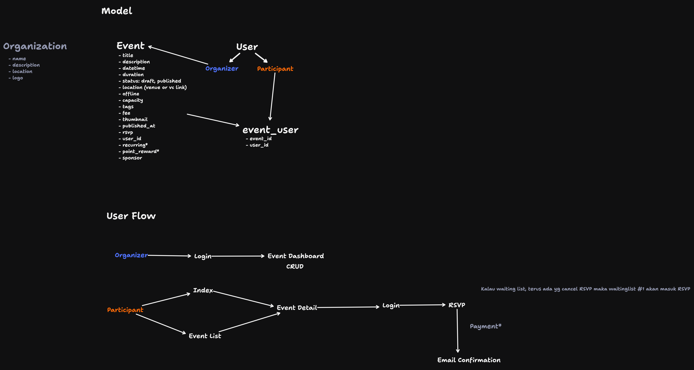

# Eventflow

Event management build with Elixir, Phoenix and DaisyUI.

## Concept

https://www.tldraw.com/ro/R9khxSVt2EanAEf4y9x0O?v=-40,-558,1512,858&p=page

## TODO

- [x] Mulai bikin modul event
- [x] Restyling layout
- [x] Restyling form login & register
- [x] Redirect after login -> /events (user_auth.ex)
- [x] Tambah `belongs_to` dan `has_many` di events & users
- [x] Tambah `user_id` ketika add event
- [x] Fitur upload image untuk thumbnail
  - [x] Rename file upload menjadi -> original name
  - [x] Simpan uploaded_files -> field thumbnail di file form_component.ex fungsi save_event :new
  - [x] Ganti upload :avatar menjadi :thumbnail
  - [x] Edit thumbnail
- [x] Bikin mockup/desain landing page
- [x] Bikin landing page -> show event list
- [ ] Bikin detail page
- [ ] Dibuat beda layout dengan admin site
- [ ] Perbaiki testing yang masih gagal (13 error lagi)

## Getting Started

To start your Phoenix server:

- Run `mix setup` to install and setup dependencies
- Start Phoenix endpoint with `mix phx.server` or inside IEx with `iex -S mix phx.server`

Now you can visit [`localhost:4000`](http://localhost:4000) from your browser.

Ready to run in production? Please [check our deployment guides](https://hexdocs.pm/phoenix/deployment.html).

# Contributing

We appreciate any contribution to Eventflow project. Please read the [CONTRIBUTING.md](CONTRIBUTING.md) file for more information. We ussualy keep a list of features and bugs in the [issue tracker](https://github.com/rizafahmi/eventflow/issues/).

## Learn more

- Official website: https://www.phoenixframework.org/
- Guides: https://hexdocs.pm/phoenix/overview.html
- Docs: https://hexdocs.pm/phoenix
- Forum: https://elixirforum.com/c/phoenix-forum
- Source: https://github.com/phoenixframework/phoenix
